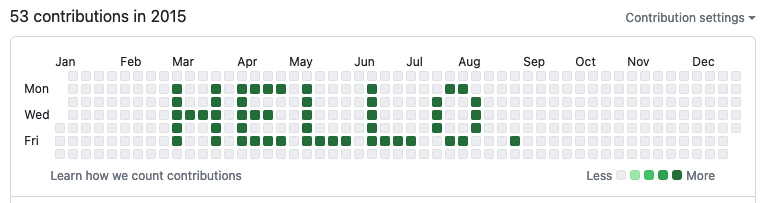

# GitHub Heatmap Text (GHHT)

Pretend the green squares on GitHub heatmaps are pixels and "render" text on them with this useless Python package.



## Example

```
mkdir commit-sink
python3 -m pip install --user https://github.com/matiaslindgren/ghht/archive/v0.1.0.zip
ghht commit-sink 'HELLO GITHUB' 2015-01-19
```
