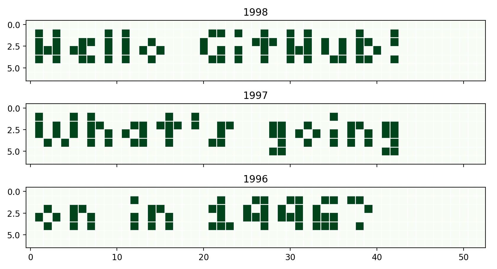

# GitHub Heatmap Text (GHHT)

Pretend the green squares on GitHub heatmaps are pixels and "render" text on them with this useless Python package.


## Example

```
python3 -m pip install --user https://github.com/matiaslindgren/ghht/archive/v0.1.0.zip

mkdir commit-sink
ghht "HELLO GITHUB" 2015 --sink ./commit-sink
```

Then push `commit-sink` to GitHub.

## Debug

Run with `--debug` to plot the text on a `matplotlib` heatmap instead of generating commits.
```
ghht "Hello GitHub! What's going on in 1996?" 1999 --debug
```


